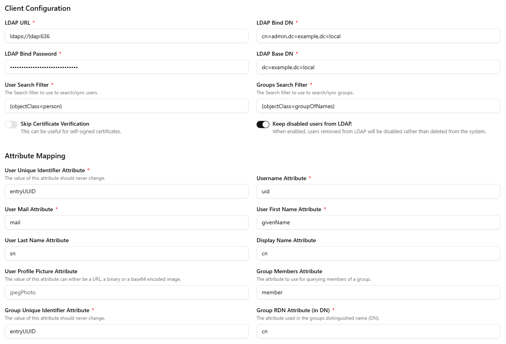

# Pocket ID Configuration Guide

> Part of the [`ldap-sso-lab`](../README.md) toolkit.

This guide walks through wiring the `pocket-id` service to the LDAP backend provided by this repository and exposing it securely behind your reverse proxy.

## 1. Prerequisites

- The Docker stack from this repo is running (`pki`, `openldap`, `phpldapadmin`, `pocket-id`).
- You have a public domain pointing to your reverse proxy (e.g., NGINX Proxy Manager) and valid TLS certificates.
- `APP_URL` inside `env/ldap-pocketid.env` matches the public HTTPS URL (`https://auth.example.com`).
- The PKI container has already generated certificates and Pocket ID restarts successfully (logs should show TLS trust initialization).

## 2. Reverse Proxy / TLS

1. Publish `pocket-id-ldap-sso:1411` through your proxy under the public domain in `APP_URL`.
2. Forward `X-Forwarded-Proto`, `X-Forwarded-For`, and `X-Forwarded-Host`.
3. Keep `TRUST_PROXY=true` so Pocket ID correctly computes external URLs.

## 3. LDAP Connector

1. Open the Pocket ID admin UI (`/admin` path) using your domain.
2. Navigate to **Settings → Authentication → LDAP**.
3. Populate the fields using the values from `env/ldap-pocketid.env`:
   - **Host**: `ldaps://ldap:636`
   - **Bind DN**: `cn=admin,dc=example,dc=local` (or your customized DN)
   - **Bind Password**: `LDAP_ADMIN_PASSWORD`
   - **Base DN**: `dc=example,dc=local` (or your customized DN)
   - **Group Attribute**: `memberOf`
4. Enable TLS verification (default) since the internal CA is imported automatically.
5. Save and run the built-in connection test to ensure Pocket ID can bind and search.

## 4. Claim Mapping

Pocket ID maps LDAP attributes to OIDC claims:

| OIDC Claim | LDAP Attribute (default) |
| --- | --- |
| `email` | `mail` |
| `name` | `cn` |
| `preferred_username` | `uid` |

Adjust the mappings under **Settings → Authentication → Attribute Mapping** if your schema differs. You can add custom claims pointing at any LDAP attribute available on the user object.

## 5. Relying Party (OIDC) Setup

1. Go to **Applications → Add Application**.
2. Choose **OIDC / OAuth2**.
3. Define the redirect URIs for your client (e.g., `https://service.example.com/callback`).
4. Copy the client ID/secret and configure them in the relying party.
5. Test the authorization code flow and confirm Pocket ID returns groups/attributes expected by the application.

## 6. Maintenance Tips

- Restart Pocket ID whenever you change `env/ldap-pocketid.env` or update the linked certificate volume.
- Use the health check (`docker compose ... logs pocket-id`) to confirm connectivity after env changes.
- Export Pocket ID settings (JSON) periodically so you can restore them quickly in another environment.
