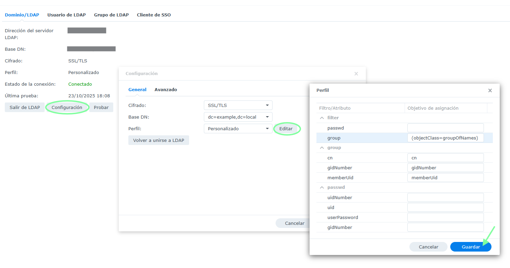
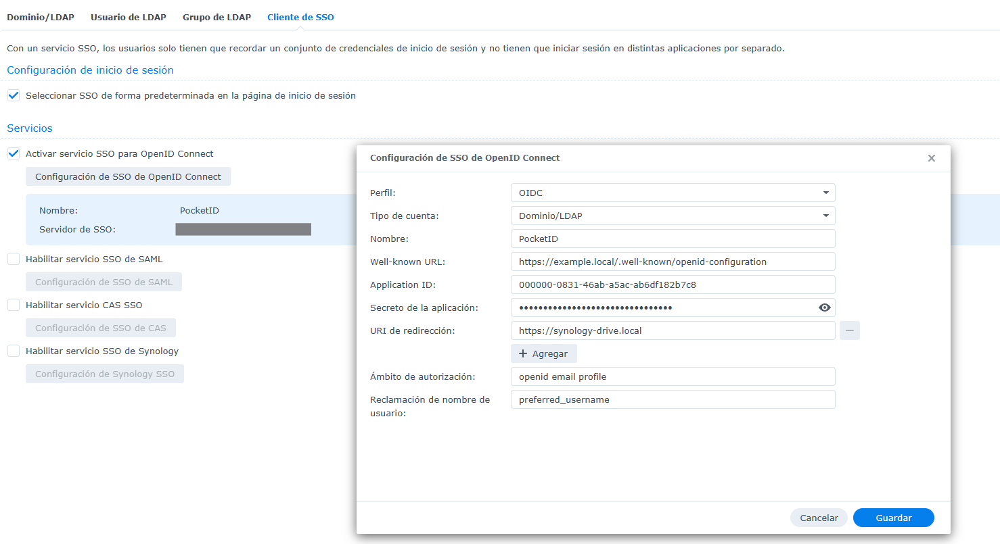

# Synology Integration Guide

> Part of the [`ldap-sso-lab`](../README.md) toolkit.

Use this guide to connect Synology DSM services to the LDAP + SSO lab.

## 1. Prerequisites

- DSM 7.0+ with admin access.
- Network reachability to the Docker host running this repo.
- TLS trust established: import `ca.crt` from the `pki` volume into DSM’s certificate store (**Control Panel → Security → Certificate → Import**). Mark it as trusted for SSL services.

## 2. Directory Service Bind

1. Navigate to **Control Panel → Domain/LDAP → LDAP**.
2. Set **LDAP server address** to the IP or hostname of your Docker host; use `ldaps://host:636`.
3. **Base DN** should match your environment (e.g., `dc=example,dc=local`).
4. **Bind DN**: `cn=admin,dc=example,dc=local` (or your custom admin DN).
5. **Password**: `LDAP_ADMIN_PASSWORD`.
6. Enable **Secure connection (SSL)**.
7. Click **Apply** and wait for the bind confirmation.

## 3. Group Mapping (Synology Services)

Synology apps often expect `groupOfNames`. Use the provided LDIF templates to create groups, then map them within DSM:

1. Go to **Control Panel → User & Group → Group**.
2. Click **Domain groups** to list LDAP groups.
3. Assign permissions per application.

## 4. Single Sign-On (Pocket ID)

To leverage Pocket ID as an external IdP for services that support SAML/OIDC:

1. Open **Control Panel → Application Portal → SSO Server**.
2. Choose **OIDC** and create a new profile named `Pocket ID`.
3. Fill out the endpoints:
   - **Issuer**: `https://auth.example.com`
   - **Authorization Endpoint**: `https://auth.example.com/oauth2/authorize`
   - **Token Endpoint**: `https://auth.example.com/oauth2/token`
   - **JWKS Endpoint**: `https://auth.example.com/.well-known/jwks.json`
4. Client credentials: use the application you created in Pocket ID (Section 5 of `docs/pocketid.md`).
5. Map attributes: `email → mail`, `name → cn`, `groups → memberOf`.

## 5. Testing

1. Log out of DSM.
2. Reopen the portal; you should be redirected to Pocket ID.
3. Authenticate with a user stored in OpenLDAP. DSM should create a session tied to the mapped groups.

## 6. Troubleshooting

- Enable DSM’s LDAP debug logs (`/var/log/messages`) to see bind/search errors.
- Verify certificates: DSM must trust the CA that signs `openldap` and the external proxy certificate.
- Use `ldapsearch` from DSM’s shell (`sudo -i`) to confirm connectivity if UI tests fail.
